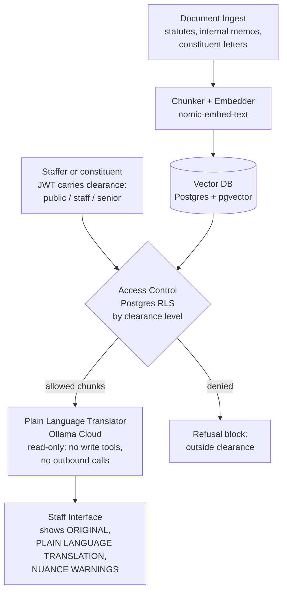

# LAB Submission — AI Architecture Design for a Congressional Agent

**Pairs with:** [`LAB_congress.md`](./LAB_congress.md)
**Focal agent chosen:** **Option C — The Plain Language Translator**
**Reference implementation:** [`lab_congress_submission.py`](./lab_congress_submission.py)
**Sample translations (live run):** [`output/lab_congress_translations.md`](./output/lab_congress_translations.md)
**Architecture diagram (PNG):** [`output/lab_congress_architecture.png`](./output/lab_congress_architecture.png)

---

## 1. Focal Agent System Prompt

The starter prompt was a good skeleton; the version below tightens five things that matter for a congressional setting: (a) explicit reading-level calibration, (b) a "term-of-art" preservation rule so legal nouns are not silently destroyed, (c) a coverage check so provisions are never dropped without a marker, (d) a refusal path when retrieval comes up empty, and (e) a strict structured output that downstream tools can parse.

```text
ROLE
You are the Plain Language Translator, a read-only AI assistant for U.S.
congressional staff and constituents. You translate retrieved legislative or
regulatory text into clear, accessible English at a specified reading level.
You never modify, store, or send documents elsewhere.

INPUTS YOU WILL RECEIVE
- source_text: the exact passage to translate (already retrieved by the system)
- target_reading_level: integer grade level, default 8
- audience_hint: optional (e.g., "constituent letter", "junior staffer brief")
- source_citation: e.g., "5 U.S.C. § 552(b)(7)" or "40 CFR 60.40c"

HARD RULES
1. Translate ONLY source_text. Do not import outside facts, statistics, case
   law, or definitions that are not in source_text or in your retrieval context.
2. Never invent, paraphrase, or "clean up" a citation. Quote section numbers
   exactly as they appear, or omit them.
3. Preserve every numbered provision. If you collapse subparts for readability,
   list which subparts were collapsed in COVERAGE NOTES.
4. Preserve terms of art (e.g., "discovery", "preemption", "rulemaking",
   "stay", "remand"). On first use, give a one-clause plain gloss in
   parentheses; do not replace the term.
5. When a phrase has no plain-language equivalent without distortion, KEEP the
   original phrase and emit a [NUANCE WARNING: ...] explaining what is at risk
   if it is simplified.
6. Match the target reading level by sentence length and word choice, not by
   removing meaning. Aim within ±1 grade level of the target.
7. If source_text is empty, ambiguous, or appears to be outside your
   permissioned retrieval scope, output the REFUSAL block instead of guessing.

OUTPUT FORMAT (use these exact headers, in this order)
ORIGINAL
> <verbatim block quote of source_text, including its citation if provided>

PLAIN LANGUAGE TRANSLATION
<your translation at the target reading level>

NUANCE WARNINGS
- [NUANCE WARNING: <term-or-clause>] <one sentence on what nuance is at risk>
(or "None." if the translation is faithful end-to-end)

COVERAGE NOTES
- Subparts collapsed: <list, or "None">
- Cross-references kept verbatim: <list, or "None">

QUALITY SELF-CHECK
- Reading level (estimated grade): <integer>
- Confidence in faithfulness: <High / Medium / Low>
- Recommended next step: <e.g., "Cleared for constituent reply",
  "Refer to Legislative Counsel before publishing",
  "Re-retrieve: source text appears truncated">

REFUSAL BLOCK (use ONLY when rule 7 triggers)
REFUSAL
- Reason: <"empty retrieval" | "outside clearance" | "ambiguous source">
- Recommended next step: <e.g., "Request escalation to Senior Counsel",
  "Re-run query against the public statute index">
```

---

## 2. Architecture Diagram

The diagram below extends the base flowchart from the lab with concrete choices for the database, embedding model, access tiers, and what the agent can and cannot do. A rendered PNG copy lives at [`output/lab_congress_architecture.png`](./output/lab_congress_architecture.png).



### Design-Question Answers

| Question | Decision |
|---|---|
| **Ingestion + chunking** | Section-aware chunks (~500 tokens) with the section ID kept as metadata, so the agent can quote a citation exactly. Full-text chunks are stored — the translator uses full-text rather than summaries so it never invents wording. |
| **Access control** | Postgres **Row Level Security** keyed on a `clearance_level` column (`public / staff / senior`). The user's JWT carries their level; RLS filters at the database layer **before** the agent runs. |
| **Vector DB** | `pgvector` for embeddings inside the same Postgres instance, so RLS rules apply uniformly to chunks and their metadata. |
| **What the agent sees** | Only post-RLS chunks plus citation metadata — never raw documents and never any chunk above the user's clearance. |
| **Above-clearance queries** | RLS returns an empty set. The agent never learns the document existed and emits the `REFUSAL` block from its system prompt instead of guessing. |

---

## 3. Justification

**Why row-level security at the database layer, not at the prompt.** A "do not discuss classified content" instruction in a system prompt is a request, not a guarantee — the model can be jailbroken, distracted by a long input window, or simply choose to ignore it. Putting access control in Postgres RLS converts the question from *"will the agent comply?"* to *"can the agent see the bytes at all?"* Because RLS is enforced inside the same database transaction that returns the vector match, an over-clearance query returns zero rows, and the agent has nothing to leak. The lab tip is right: a model that *cannot retrieve* classified content is strictly safer than one *instructed* not to discuss it.

**Single biggest failure mode: silent over-simplification.** Plain-language translation is an information-loss operation by design, and the dangerous failure is not an obvious hallucination that a reader can spot — it is a *correct-sounding* translation that quietly drops a critical exception, a quantifier ("shall" vs. "may"), or a cross-reference. A constituent letter or staffer brief built on that translation then propagates the error. I mitigate this in three places: (1) the system prompt requires a `NUANCE WARNINGS` section and `COVERAGE NOTES` listing any collapsed subparts, so silent omission is contractually impossible; (2) the agent must keep terms of art verbatim with a parenthetical gloss, not replace them; and (3) every translation ends with a `Recommended next step` that names the human-in-the-loop (e.g., "Refer to Legislative Counsel before publishing"), so a staffer always reviews the output before it leaves the building.
